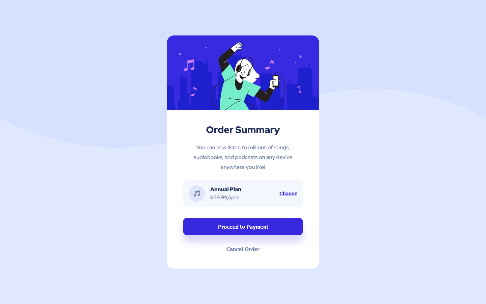

# Frontend Mentor - Order summary card solution

This is a solution to the [Order summary card challenge on Frontend Mentor](https://www.frontendmentor.io/challenges/order-summary-component-QlPmajDUj). Frontend Mentor challenges help you improve your coding skills by building realistic projects. 

## Table of contents

- [Overview](#overview)
  - [The challenge](#the-challenge)
  - [Screenshot](#screenshot)
  - [Links](#links)
- [My process](#my-process)
  - [Built with](#built-with)
  - [What I learned](#what-i-learned)
- [Author](#author)

## Overview

### The challenge

Users should be able to:

- See hover states for interactive elements

### Screenshot

Desktop

Mobile

### Links

- Solution URL: [Add solution URL here](https://your-solution-url.com)
- Live Site URL: [Add live site URL here](https://your-live-site-url.com)

## My process

### Built with

- Semantic HTML5 markup
- CSS custom properties
- Flexbox
- CSS Grid
- Mobile-first workflow
- [SASS](https://sass-lang.com/) - CSS Preprocessor

### What I learned

I learned how to configure and use the Live SASS VS Code extension to process SASS code to CSS.
In this  project i experimented with the basics of SASS: nesting, using partials, variables and mixins. 

## Author

- Frontend Mentor - [@abedfetrat](https://www.frontendmentor.io/profile/abedfetrat)
- LinkedIn - [@abedfetrat](https://www.linkedin.com/in/abed-fetrat-84728717a?lipi=urn%3Ali%3Apage%3Ad_flagship3_profile_view_base_contact_details%3BUKdPHQu3Qm%2B6krqAb0fxCw%3D%3D)